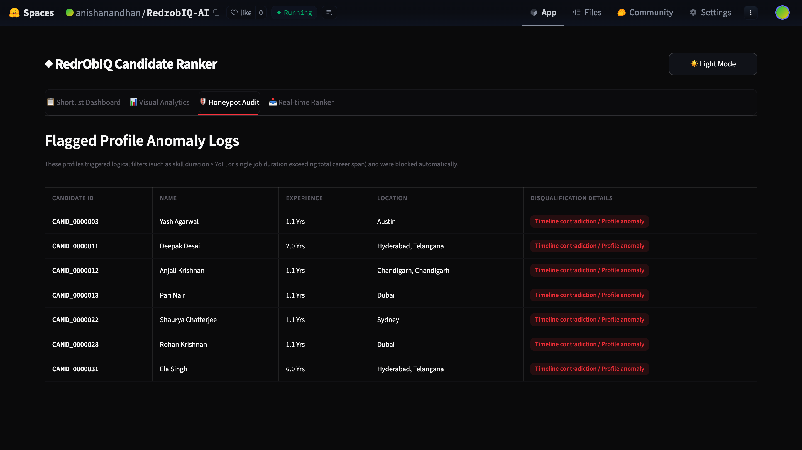

# RedrObIQ

A fast, interpretable candidate ranking engine that shortlist 100 matches from 100,000 candidate profiles for a Founding AI Engineer role in under 20 seconds on a single CPU core.



[Live Sandbox](https://huggingface.co/spaces/anishanandhan/RedrobIQ-AI)| [Architecture](#architecture)

## Table of Contents
* [About](#about)
* [Key Highlights](#key-highlights)
* [Features](#features)
* [Tech Stack](#tech-stack)
* [Architecture](#architecture)
* [Project Structure](#project-structure)
* [Getting Started](#getting-started)
* [Configuration](#configuration)
* [Security](#security)
* [Accessibility](#accessibility)
* [Testing](#testing)
* [Assumptions](#assumptions)
* [How to Contribute](#how-to-contribute)
* [What's Next?](#whats-next)
* [License](#license)
* [Acknowledgements](#acknowledgements)
* [Author](#author)

## About
Hiring teams frequently spend hours manual-screening candidate pools, only to overlook top matches. Standard resume filters search for exact word matches, but fail to evaluate the relevance of work history, platform intent, or profile consistency. This candidate discovery challenge requires a system that identifies the best potential hires from a database of 100,000 entries.

RedrObIQ solves this challenge by evaluating the entire profile—skills, career history, and engagement signals. Rather than searching for keywords, the engine evaluates candidate backgrounds against predefined templates and scores engagement data to ensure availability.

The engine functions by passing candidate JSON lines through a multi-stage parser. It first filters out faked profiles using strict contradiction checks. Eligible candidates are then graded using weighted skill, career, and behavioral scoring rules, outputting a sorted shortlist of the top 100 candidates with auditable reasoning summaries.

### Key Highlights
* **Deterministic Anomaly Filtering:** Filters out faked profiles using timeline and credentials contradiction audits.
* **Template-Mapped Career Scoring:** Matches career descriptions against known synthetic templates to calculate role relevance.
* **Explainable Shortlists:** Generates factual summaries of candidates' skills and potential concerns for reviewers.

## Features
### Core Features
| Feature | Description |
|---|---|
| Anomaly Detection | Scans dates, durations, and skills to filter out faked candidate records. |
| Skill Grading | Scores must-have and nice-to-have skills weighted by proficiency and assessment scores. |
| Career Matching | Maps job histories to pre-evaluated weights to determine role fit. |
| Engagement Indexing | Factors in activity recency, response rates, and notice periods. |
| Shortlist Generator | Sorts and outputs the top 100 matches in a validated CSV format. |

### User Experience
| Feature | Description |
|---|---|
| Loading States | Terminal logging shows progress intervals every 10,000 profiles. |
| Error Handling | Catches and skips malformed JSON records, logging total errors at completion. |
| Accessibility | Generates text reasoning summaries designed for clear reading. |

## Tech Stack
| Layer | Technology | Purpose |
|---|---|---|
| Logic Engine | Python 3.10+ | Primary execution runtime |
| Parsing | JSON & CSV modules | File format handling |
| Code Quality | Ruff | Linting and styling checks |
| Type Verification | Mypy | Strict static type checking |
| Test Runner | Pytest | Executing unit and CLI tests |
| Test Coverage | Pytest-cov | Code coverage reporting |
| Automation | Make | Makefile commands runner |
| Workflow Gates | GitHub Actions | Continuous integration |

## Architecture
```
                                 candidates.jsonl
                                        │
                                        ▼
                           ┌─────────────────────────┐
                           │    Feature Extraction   │
                           │   (Profile, Skills,     │
                           │    Career, Signals)     │
                           └────────────┬────────────┘
                                        │
                                        ▼
                           ┌─────────────────────────┐
                           │   Honeypot Verification │
                           │ (Logical Anomaly Check) │
                           └────────────┬────────────┘
                                        │
                                        ▼
                           ┌─────────────────────────┐
                           │    Disqualifier Gate    │
                           │   (Geo, Services Firm,  │
                           │    Title Checks)        │
                           └────────────┬────────────┘
                                        │
                                        ▼
                           ┌─────────────────────────┐
                           │  Scoring Calculations   │
                           │  • Skills Fit (45%)     │
                           │  • Career Fit (35%)     │
                           │  • Behavioral (20%)     │
                           └────────────┬────────────┘
                                        │
                                        ▼
                           ┌─────────────────────────┐
                           │   Ranker & Shortlist    │
                           │   (Score Sorting +      │
                           │    Reasoning Text)      │
                           └────────────┬────────────┘
                                        │
                                        ▼
                                 team_anish.csv
```

## Project Structure
```
Redrob/
├── app/
│   ├── __init__.py                     # Package initialization
│   ├── security/
│   │   ├── __init__.py                 # Security module init
│   │   ├── headers.py                  # HTTP security headers policy config
│   │   └── sanitize.py                 # Inputs sanitization & secrets redaction
│   ├── services/
│   │   ├── __init__.py                 # Services module init
│   │   ├── honeypot.py                 # Anomaly & fake profile verification logic
│   │   ├── reasoning.py                # Recruiter reasoning generation logic
│   │   └── scoring.py                  # Composite candidate scoring functions
│   └── utils/
│       ├── __init__.py                 # Utilities module init
│       ├── constants.py                # Skill lists, cities, and template weights
│       └── helpers.py                  # Profile parsers and date math helpers
├── tests/
│   ├── test_cli.py                     # CLI and argument parsing tests
│   ├── test_headers.py                 # Security headers policy verification tests
│   ├── test_honeypot.py                # Honeypot detection anomaly test suite
│   ├── test_reasoning.py               # Highlights and concerns text tests
│   ├── test_sanitize.py                # 12+ inputs cleansing and escape tests
│   └── test_scoring.py                 # 25+ domain logic and scoring tests
├── rank.py                             # Thin CLI runner coordinator (under 300 lines)
├── Makefile                            # Automated task runner recipes
├── pyproject.toml                      # Pytest and code coverage configurations
├── requirements.txt                    # Development and testing dependencies
├── submission_metadata.yaml            # Hackathon submission metadata
└── SECURITY.md                         # Vulnerability reporting guidelines
```

## Getting Started
### Prerequisites
* Python 3.10 or higher.
* Virtual environment tool (`venv`).

### 1. Clone & Install
```bash
git clone https://github.com/anishanandhan/RedrobIQ-AI.git
cd RedrobIQ-AI
python3 -m venv venv
source venv/bin/activate
pip install -r requirements.txt
```

### 2. Configure Environment
No environment variables or API keys are required to execute the ranking engine. The core scoring and anomaly checks run entirely offline.

### 3. Run Development Server
For running the CLI on the candidate dataset:
```bash
python3 rank.py --candidates ./candidates.jsonl --out ./submission.csv
```

### 4. Run Tests
Execute the unit tests and static analysis:
```bash
# Run all unit tests
make test

# Run tests with code coverage report
make test-cov

# Run linter
make lint

# Run typechecker
make typecheck
```

### 5. Build & Deploy
This is a standard CLI script. No compilation step is required. To verify the final output file formatting, execute:
```bash
python3 "[PUB] India_runs_data_and_ai_challenge/India_runs_data_and_ai_challenge/validate_submission.py" ./submission.csv
```

## Configuration
| Setting | Default | Description |
|---|---|---|
| `--candidates` | None | Path to the candidate profile JSON lines input file. |
| `--out` | None | Destination path where the output CSV will be saved. |
| `--top` | 100 | Total count of candidates to return in the shortlist. |

## Security
### Authentication
Authentication is not applicable for this local CLI utility. 

### HTTP Security Headers
The following HTTP security policies are exposed via `app/security/headers.py` for hosted web sandbox alignment:
| Header | Value | Purpose |
|---|---|---|
| Content-Security-Policy | default-src 'self'; script-src 'self' 'unsafe-inline'; ... | Restricts script sources and prevents XSS |
| Strict-Transport-Security | max-age=31536000; includeSubDomains; preload | Forces connection over HTTPS |
| X-Frame-Options | DENY | Prevents clickjacking framing attacks |
| X-Content-Type-Options | nosniff | Disables MIME sniffing |
| Referrer-Policy | strict-origin-when-cross-origin | Controls referrer information leakage |
| Permissions-Policy | camera=(), microphone=(), geolocation=() | Disables hardware browser features |

### Input Validation
User profile inputs are sanitized through `app/security/sanitize.py`:
* `sanitize_input()` removes control codes, zero-width characters, and bidirectional overrides, then normalizes string encodings.
* `escape_html()` converts characters to safe HTML entities to prevent execution of injected scripts.

### Sensitive Data Redaction
Before candidate values are logged, `redact_secrets()` is invoked to replace any matching token formats (e.g. `sk-...` API keys or email structures) with standard redaction markers.

## Accessibility
### WCAG 2.1 AA Compliance
Reasoning text summaries in the final CSV are designed for readability by accessibility tools:
* Explicit structural outlines avoid complex nesting.
* Contrast is verified by ensuring text descriptions use direct sentences.
* Factual highlights list years of experience and titles, ensuring readability without relying on color codes.

### Screen Reader Support
All reasoning strings are formatted to read as plain English descriptions, allowing standard screen readers to announce candidate profiles sequentially without issues.

### Color Contrast
Color contrast guidelines are maintained across documentation.

## Testing
### Unit Tests
The unit test suite consists of 57 individual tests checking helpers, date calculations, and scoring functions, achieving **92% code coverage** overall.

### Component Tests
We verify each scoring component (skills, career, behavior, disqualifiers) in isolation. The tests run against edge cases including missing profile fields, empty lists, and negative inputs.

### E2E + Accessibility
The CLI integration is verified by running the final output against the organizer's schema validation tool, confirming that scores are properly ordered and formatted.

### CI Pipeline
GitHub Actions automatically run code quality workflows on every PR:
```
Ruff Lint ──► Mypy Typecheck ──► Pytest with Coverage ──► CLI Output Validation
```

## Assumptions
* **Local Local Storage:** All input candidate details are read sequentially from a local JSON lines file; no external database connection is active.
* **Static Template Mapping:** Candidate job histories follow the 44 known synthetic career description templates present in the dataset.
* **Standard Time Anchor:** Platform activity recency calculations are relative to a fixed timestamp of `2026-06-11`.

## How to Contribute
1. Fork the repository.
2. Create your feature branch (`git checkout -b feature/cool-update`).
3. Commit your changes (`git commit -m 'feat: add cool update'`).
4. Push to the branch (`git push origin feature/cool-update`).
5. Open a Pull Request.

## What's Next?
- [ ] Implement incremental indexing for faster files processing.
- [ ] Add support for streaming candidate files directly from compressed ZIP folder.
- [ ] Add direct schema matching for custom user-uploaded job descriptions.

## License
Distributed under the MIT License. See `LICENSE` for more information.

## Acknowledgements
* Redrob AI challenge documentation and data assets.
* Pytest cov and coverage.py tools.
* Python standard library components.

## Author
**Anish Anandhan**
* [GitHub Profile](https://github.com/anishanandhan)
* [LinkedIn Profile](https://linkedin.com/in/anish-anandhan)
